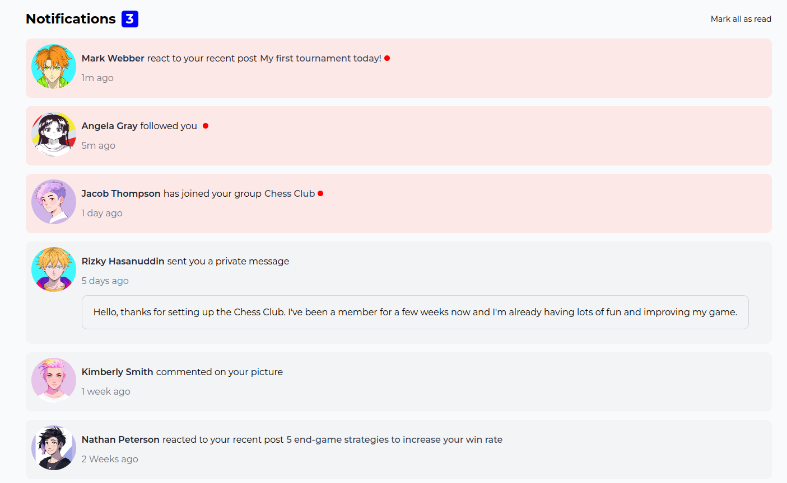
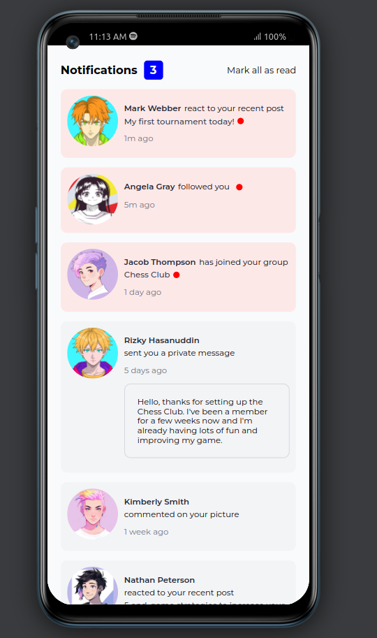

# Notifications Page
This is a simple notifications page built using React.js. It uses JSON data to populate notifications.

## Getting Started
To run this project locally, follow these steps:
1. Clone the repository:
```bash
git clone https://github.com/Caleb-ne1/notifications-page.git
```
2. Navigate to the project directory:
```bash
cd notifications-page
```
3. Install the dependencies:
```bash
npm install
```
4. Start the development server:
```bash
npm start
```
5. Open your web browser and visit http://localhost:3000 to see the notifications page.

